# Mezon Desktop — GPUI Architecture, Rendering, Realtime & Performance

> **Scope:** tài liệu này mô tả architecture và conventions của Mezon Desktop dựa trên GPUI `0.2.2` đang được vendor trong project.
>
> Các implementation detail của GPUI có thể thay đổi khi upgrade version. Khi một rule phụ thuộc version, tài liệu sẽ đánh dấu rõ.

## Cách đọc tài liệu

Mỗi nội dung thuộc một trong ba nhóm:

- **`[GPUI 0.2.2]`**: behavior được xác nhận từ GPUI API hoặc source của version đang dùng.
- **`[Mezon convention]`**: rule do project Mezon Desktop quy định.
- **`[Mental model]`**: phép so sánh để developer từ Web/React dễ hiểu; không phải mapping 1:1.

---

# PHẦN I — GPUI mental model

## 1. Browser và GPUI render pipeline

### 1.1 Browser render pipeline

Browser không phải lúc nào cũng chạy toàn bộ `style → layout → paint → composite` sau mỗi DOM mutation. Work thực tế phụ thuộc loại thay đổi và phạm vi invalidation:

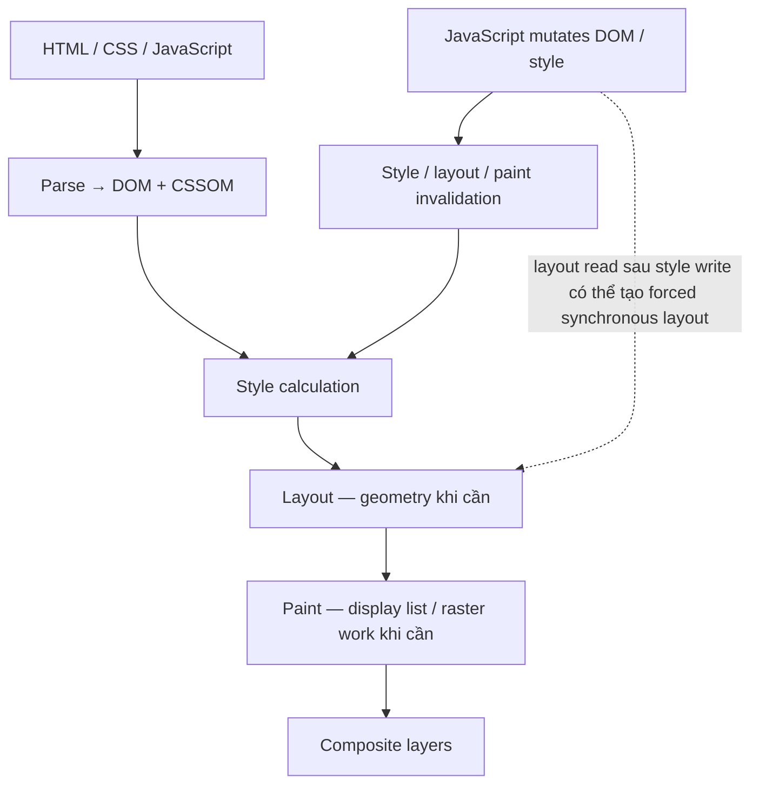

Ví dụ:

| Thay đổi | Work thường gặp |
|---|---|
| JavaScript state không liên quan UI | Không nhất thiết có render work |
| `color`, `background` | Thường `paint`, không nhất thiết `layout` |
| `width`, `height`, font metrics | Có thể tạo `layout` và `paint` |
| `transform`, `opacity` trên promoted layer | Có thể chỉ cần `composite` |
| Đọc geometry sau khi write style lặp lại | Có thể tạo `layout thrashing` |

Browser vẫn có nhiều optimization như dirty region, layer promotion, CSS containment, `content-visibility`, virtualized list và off-main-thread rasterization. Vì vậy không nên mô tả browser là luôn `global reflow` sau mọi mutation.

### 1.2 GPUI render pipeline

**`[GPUI 0.2.2]`** GPUI là một **hybrid immediate-mode và retained-mode, GPU-accelerated UI framework**. Application giữ state bằng Rust values và `Entity<T>`, còn element tree được tạo từ `Render::render()` khi view cần update.

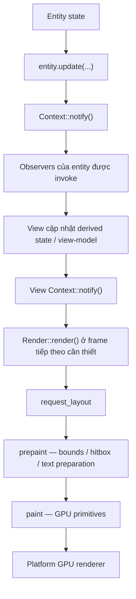

> Không hard-code toàn bộ GPUI `0.2.2` thành `wgpu`. Nên dùng thuật ngữ **platform GPU renderer**. Trong current macOS build của project, backend là Metal.

### 1.3 So sánh đúng phạm vi

| Concern | Browser | GPUI |
|---|---|---|
| UI source | DOM/CSSOM + JavaScript state | Rust state + `Entity<T>` + generated element tree |
| State mutation | JavaScript/DOM APIs | `Entity::update` / methods trên store hoặc view |
| Invalidation | Style/layout/paint invalidation | `Context::notify()` và observer chain |
| Layout | Browser layout engines | GPUI element layout, dùng Taffy cho nhiều layout primitives |
| Paint | Browser paint/raster pipeline | GPUI `prepaint`/`paint` → platform GPU renderer |
| Large list | DOM virtualization library hoặc browser optimizations | `list` / `uniform_list` và project-level virtualization |
| Stable subtree | React memoization, CSS containment, `content-visibility` | entity split, scoped notify, cached elements, virtualized list |

### 1.4 Kết luận chính xác

GPUI **cung cấp tools** để giới hạn work:

- split state thành nhiều `Entity`;
- scoped `notify()`;
- virtualized list;
- cached/stable elements;
- background executor cho CPU-heavy work.

Tuy nhiên cost chỉ thật sự bounded khi application sử dụng đúng:

- không scan toàn dataset trước khi render visible rows;
- không clone collection lớn trong `render()`;
- không notify root cho local change;
- không tạo unbounded cache;
- không update layout size của ancestor lớn mỗi animation frame.

---

## 2. React/Redux → GPUI mental mapping

> **`[Mental model]`** Bảng dưới đây giúp chuyển tư duy, không phải API equivalence 1:1.

| React / Redux | GPUI gần tương đương |
|---|---|
| Component local state | fields trong view `Entity<T>` |
| App-scoped store | `Entity<Store>` được giữ qua `Global` |
| Redux slice | một store/domain entity, không phải mọi `Entity<T>` |
| `useSelector` | `observe` + `read` + derive view-model + equality/no-op guard |
| `dispatch(action)` | gọi method trong `entity.update(...)` |
| `store.subscribe()` | `cx.observe(&entity, ...)` |
| event channel | `cx.emit(Event)` + `cx.subscribe(...)` |
| React component render | `impl Render for View` |
| React Router | `[Mezon convention] Router` global + `Route` enum |
| `useEffect` cleanup | `Subscription`/`Task` ownership hoặc `on_release` |

`entity.read(cx)` chỉ là **read access**. Nó không tự tạo subscription, selector memoization hoặc equality check như `useSelector`.

`Context<T>` nên được hiểu là entity-aware application context cung cấp:

- entity access;
- update/notification APIs;
- subscription/observer registration;
- task scheduling;
- application/window services.

Không nên định nghĩa `cx` chính xác bằng `dispatch + getState + scheduler`, vì đó chỉ là một mental model rút gọn.

---

## 3. Entity lifecycle, Subscription và Task ownership

### 3.1 Entity lifecycle

**`[GPUI 0.2.2]`** Entity lifecycle dựa trên ownership của strong handles:

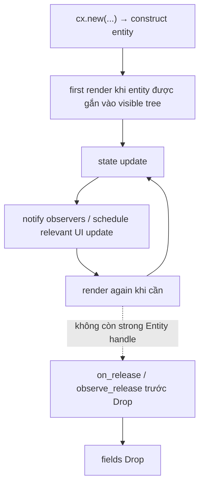

| React concept | GPUI gần tương đương |
|---|---|
| constructor | `cx.new(|cx| View::new(...))` |
| first mount | lần đầu view tham gia render tree |
| re-render | `render()` sau relevant notification/state change |
| effect subscription | `cx.observe` / `cx.subscribe` được giữ bằng `Subscription` |
| unmount cleanup | `Subscription`/`Task` Drop, `on_release`, field Drop |
| next visual frame | `cx.on_next_frame(...)` |
| defer work | `cx.defer(...)` |

### 3.2 Subscription ownership

**`[GPUI 0.2.2]`**:

- `Subscription` bị cancel khi handle bị Drop.
- `Subscription::detach()` làm callback tiếp tục tồn tại đến khi các subscribed entities bị Drop.

```rust
pub struct ClanSidebar {
    clan_list: Entity<ClanList>,
    _clan_sub: Subscription,
    _router_sub: Subscription,
}
```

**`[Mezon convention]`**:

- subscription gắn với view/store lifecycle phải được giữ trong field;
- không register subscription trong `render()`;
- chỉ `detach()` khi lifecycle đã được phân tích rõ.

### 3.3 Task ownership

**`[GPUI 0.2.2]`**:

- `Task<T>` implement `Future`, có thể `.await`;
- Drop một `Task` sẽ cancel task ngay;
- `Task::detach()` cho task chạy đến completion nhưng không còn cách nhận return value;
- `detach_and_log_err()` phù hợp với fire-and-forget `Result` cần logging.

```rust
pub struct CreateClanModal {
    create_task: Option<Task<()>>,
}
```

| Cách dùng | Lifecycle |
|---|---|
| giữ `Task` trong field | owner Drop → task bị cancel |
| `.await` task | caller chờ result |
| `.detach()` | chạy độc lập đến completion |
| `.detach_and_log_err(cx)` | chạy độc lập và log error |

**Không được viết chung rằng “view Drop sẽ cancel mọi task”**. Điều đó không đúng với task đã `detach()`.

### 3.4 Release resource rõ ràng

```rust
cx.on_release(|cache, cx| {
    for (_, mut entry) in std::mem::take(&mut cache.entries) {
        entry.abort.abort();

        if let Some(Ok(image)) = entry.item.get() {
            cx.drop_image(image, None);
        }
    }
})
.detach();
```

Use case:

- cancel image decode;
- release GPU texture;
- close custom channel/resource;
- flush bounded state khi owner thực sự release.

---

# PHẦN II — Project architecture

## 4. Crate layering

> **`[Mezon convention]`** Dependency chỉ đi theo allowed direction. UI không gọi transport trực tiếp và không giữ API DTO.

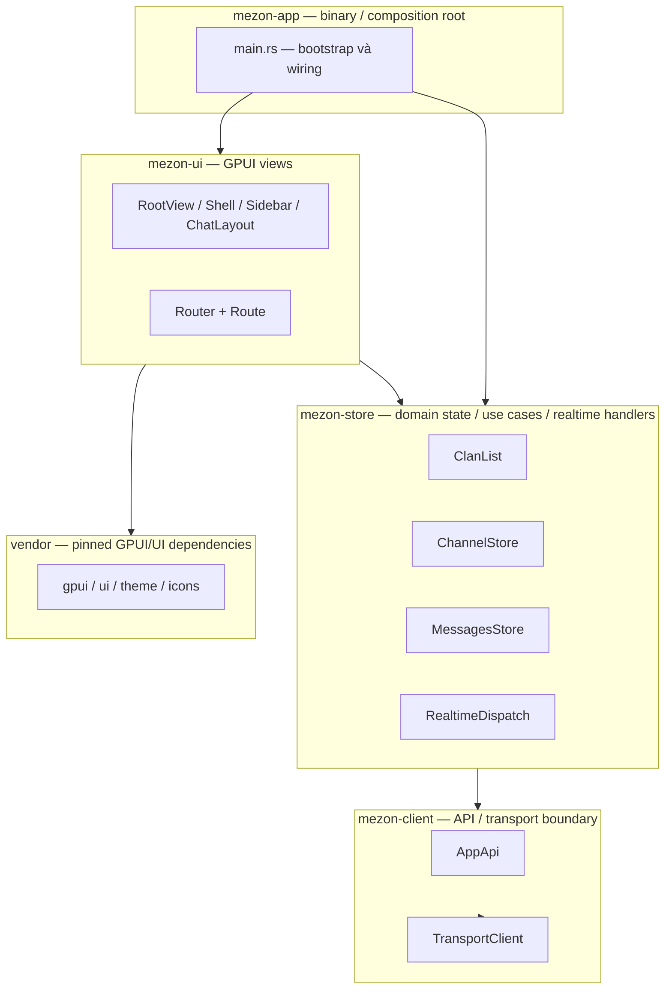

| Layer | Trách nhiệm | Không được |
|---|---|---|
| `mezon-client` | request/response, socket, transport status, API DTO | chứa UI state |
| `mezon-store` | domain state, use case, DTO→domain mapping, realtime apply | depend vào `mezon-ui` |
| `mezon-ui` | render, input, view-model, navigation intent | depend trực tiếp `mezon-client`, giữ `Api*` DTO |
| `mezon-app` | bootstrap, dependency wiring, global initialization | chứa business logic dài hạn |
| `vendor/**` | pinned upstream code | sửa tùy tiện cho feature local |

### 4.1 Domain boundary

```rust
pub struct Clan {
    pub id: ClanId,
    pub name: SharedString,
    pub logo_url: Option<SharedString>,
}

impl From<ApiClanDesc> for Clan {
    fn from(value: ApiClanDesc) -> Self {
        Self {
            id: ClanId(value.clan_id),
            name: value.clan_name.into(),
            logo_url: (!value.logo.is_empty()).then(|| value.logo.into()),
        }
    }
}
```

UI chỉ thấy `Clan`, không thấy `ApiClanDesc`.

---

## 5. Architecture patterns đang dùng

Tổng thể là **Layered Architecture + reactive one-way data flow**, có chọn lọc một số ideas từ Clean Architecture, DDD và Flux.

| Pattern | Áp dụng |
|---|---|
| Observer | `cx.observe`, `cx.subscribe` |
| Mediator | `RealtimeDispatch` demultiplex một realtime source cho nhiều stores |
| Adapter | `TransportClient`, DTO→domain converters |
| State Machine | `AuthState`, `Route`, modal step, connection state |
| Command | `gpui::actions!` và action handlers |
| Factory/bootstrap | `init()`, `cx.new()` |
| RAII | `Subscription`, `Task`, handles Drop để cleanup |
| Anti-Corruption Layer | mapping API DTO sang domain model |

### 5.1 Global usage

`Global` là convenient nhưng tạo hidden dependency và initialization-order constraint.

**Dùng `Global` cho:**

- application-wide service;
- router;
- theme/settings;
- store thật sự shared giữa windows/views.

**Không dùng `Global` cho:**

- modal draft;
- screen-local form state;
- temporary loading state;
- state chỉ thuộc một window;
- row-local interaction state.

---

## 6. Recommended bootstrap order

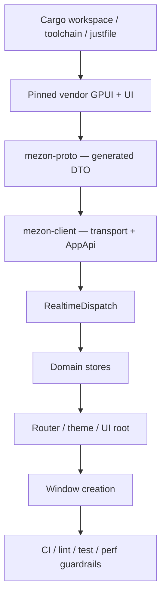

Initialization order phải là explicit invariant. Ví dụ `RealtimeDispatch` phải tồn tại trước khi store register realtime handlers.

---

# PHẦN III — State, notification và realtime

## 7. One-way data flow

```mermaid
flowchart LR
  EVENT["User input / server event"] --> ACTION["View invokes store method"]
  ACTION --> STORE["Store updates domain state"]
  STORE --> SNOTIFY["Store cx.notify()"]
  SNOTIFY --> OBSERVE["View observer callback"]
  OBSERVE --> VM["derive/sync view-model"]
  VM --> VNOTIFY["View cx.notify()"]
  VNOTIFY --> RENDER["View render()"]
```

### 7.1 Hai loại notification cần phân biệt

#### Store notification

```rust
store.update(cx, |store, cx| {
    if store.badge_count == new_count {
        return;
    }

    store.badge_count = new_count;
    cx.notify(); // notify observers của Store entity
});
```

#### View notification trong observer

```rust
let clan_sub = cx.observe(&clan_list, |this, clan_list, cx| {
    let next_rows = build_clan_rows(clan_list.read(cx));

    if this.rows == next_rows {
        return;
    }

    this.rows = next_rows;
    cx.notify(); // notify rằng View entity cần update
});
```

`Store::notify()` không đồng nghĩa trực tiếp với “ClanSidebar render ngay”. Nó invoke observer chain; view thường phải update derived state và gọi `View::notify()`.

---

## 8. Store pattern

Một store nên có bốn nhóm responsibility:

1. initialization và dependency ownership;
2. API load/mutation;
3. realtime event apply;
4. state notification và typed events/errors.

```rust
pub enum LoadState {
    Idle,
    Loading,
    Ready,
    Error(SharedString),
}

pub struct ClanList {
    pub clans: Vec<Clan>,
    pub active_clan_id: Option<ClanId>,
    pub load_state: LoadState,

    api: Arc<AppApi>,
    reload_generation: u64,
    connection_watch: Task<()>,
}
```

### 8.1 Không fetch trong `render()`

`render()` phải là bounded UI construction. Network load được trigger từ:

- store initialization;
- connection state transition;
- explicit user action;
- route/scope change;
- realtime recovery sau lag.

---

## 9. Realtime dispatch

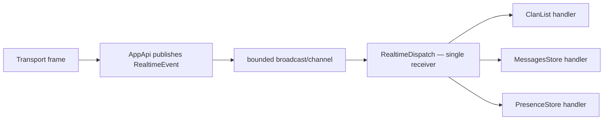

`RealtimeDispatch` đóng vai trò mediator:

- chỉ một receiver đọc source;
- route event theo kind;
- handler giữ `WeakEntity`;
- store Drop thì handler không giữ store sống vĩnh viễn;
- khi channel lag, store phải có recovery strategy như reload/resync.

```rust
fn register_realtime(cx: &mut Context<Self>) {
    let entity = cx.entity();

    RealtimeDispatch::global(cx).update(cx, |dispatch, _| {
        dispatch.on(
            RealtimeKind::ClanUpdated,
            &entity,
            |this, event, cx| this.handle_event(event, cx),
        );

        dispatch.on_lagged(&entity, |this, cx| {
            this.reload(cx);
        });
    });
}
```

### 9.1 Realtime apply rules

- event handler phải idempotent khi có thể;
- no-op nếu value không đổi;
- deduplicate bằng event ID/version khi protocol hỗ trợ;
- không reorder list lớn trong hot path nếu có thể update index tại chỗ;
- coalesce presence/typing events;
- lag/reconnect phải có full resync path.

---

# PHẦN IV — Async correctness

## 10. Reload pattern: loading, error và stale response

Một `loading: bool` đơn lẻ chưa đủ để chống stale response. Cần reset state trên mọi path và dùng request generation hoặc cancellation.

```rust
pub fn reload(&mut self, cx: &mut Context<Self>) {
    self.reload_generation = self.reload_generation.wrapping_add(1);
    let generation = self.reload_generation;

    self.load_state = LoadState::Loading;
    cx.notify();

    let api = self.api.clone();

    cx.spawn(async move |this, cx| {
        let result = tokio::try_join!(
            api.list_clan_descs(),
            api.list_clan_badge_count(),
        );

        let _ = this.update(cx, |this, cx| {
            // Response cũ không được overwrite state mới.
            if generation != this.reload_generation {
                return;
            }

            match result {
                Ok((descs, badges)) => {
                    this.clans = map_clans(descs, badges);
                    this.load_state = LoadState::Ready;
                }
                Err(error) => {
                    this.load_state = LoadState::Error(error.to_string().into());
                }
            }

            cx.notify();
        });
    })
    .detach();
}
```

> Tùy GPUI error type và project helper, signature có thể cần điều chỉnh. Rule quan trọng là: **generation guard + reset load state + explicit error path**.

### 10.1 Khi scope thay đổi

Ví dụ load messages theo `channel_id`:

- capture `channel_id` và `generation`;
- khi response về, kiểm tra channel còn active hoặc cache target vẫn hợp lệ;
- không cho response của channel trước overwrite active timeline;
- pagination request phải kiểm tra cursor/version.

### 10.2 Debounce, cancellation và last-write-wins

| Use case | Strategy |
|---|---|
| Search input | debounce + cancel previous task |
| Route/channel switch | generation guard + scoped cache |
| Avatar decode | cache key + abort handle |
| Presence burst | coalesce theo short interval/frame |
| Create/update command | disable duplicate submit + idempotency key nếu server support |

---

## 11. Clan flow end-to-end

### 11.1 Boot

```rust
let transport = Arc::new(TransportClient::new(/* ... */));
let api = Arc::new(AppApi::new(Arc::clone(&transport)));

// Dispatcher phải tồn tại trước các stores register handler.
RealtimeDispatch::init(Arc::clone(&api), cx);

ClanList::init(Arc::clone(&api), cx);
ChannelStore::init(Arc::clone(&api), cx);
MessagesStore::init(Arc::clone(&api), cx);

ConnectionStore::init(transport, api, auth_state, cx);
```

`main.rs` chỉ làm composition/wiring. Connection policy, reload behavior và domain state không được chuyển vào composition root.

### 11.2 Initial load sau connection

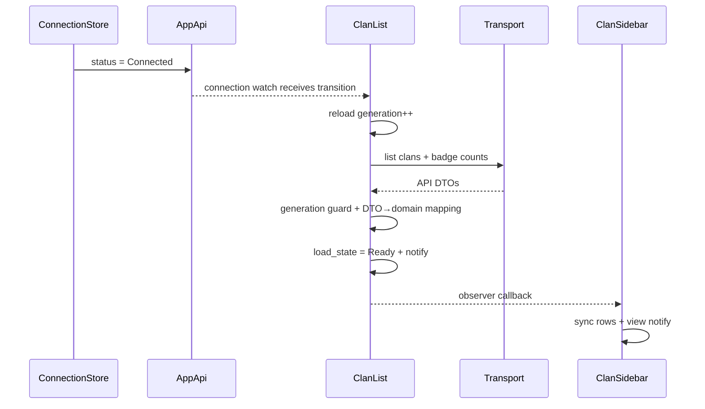

Connection watch phải chống duplicate reload nếu cùng một connection state được emit nhiều lần.

### 11.3 User selects a clan

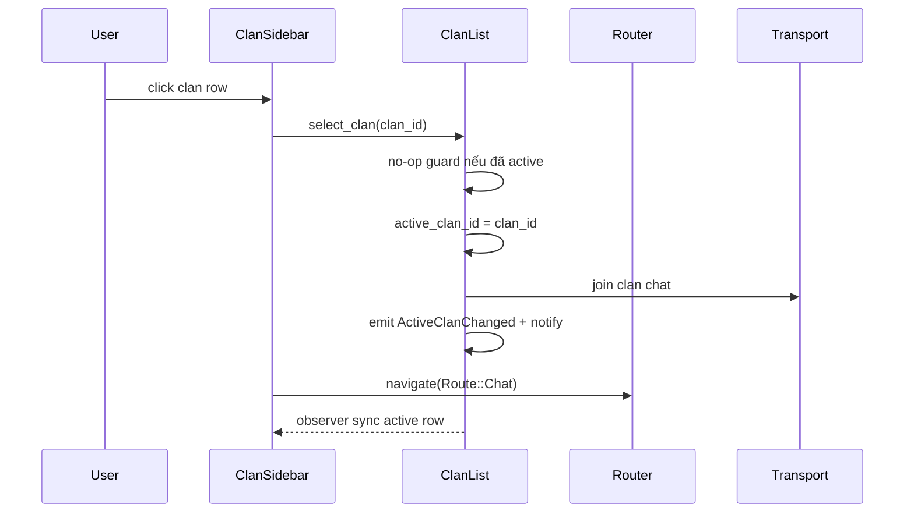

```rust
pub fn select_clan(&mut self, id: ClanId, cx: &mut Context<Self>) {
    if self.active_clan_id == Some(id) {
        return;
    }

    self.active_clan_id = Some(id);
    self.fire_join_clan_chat(id, cx);
    cx.emit(ClanEvent::ActiveClanChanged(Some(id)));
    cx.notify();
}
```

Click handler chỉ dispatch domain intent và navigation intent. Nó không mutate visual row state riêng để giả lập active clan.

### 11.4 Server pushes Clan update

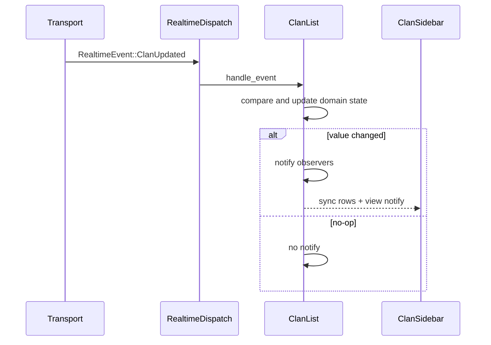

```rust
fn handle_event(&mut self, event: &RealtimeEvent, cx: &mut Context<Self>) {
    match event {
        RealtimeEvent::ClanUpdated(update) => {
            if update_clan(&mut self.clans, update) {
                cx.notify();
            }
        }
        RealtimeEvent::ClanDeleted(deleted) => {
            if remove_clan(&mut self.clans, ClanId(deleted.clan_id)) {
                cx.emit(ClanEvent::Deleted(ClanId(deleted.clan_id)));
                cx.notify();
            }
        }
        _ => {}
    }
}
```

### 11.5 Create Clan

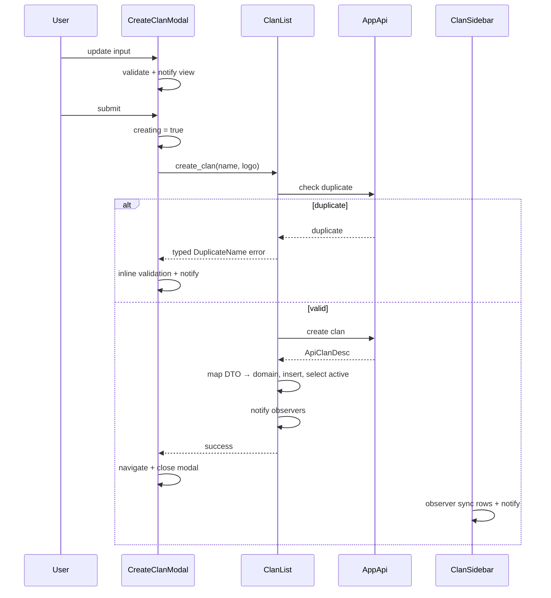

**Boundary:**

- modal điều phối form state và visual feedback;
- store thực hiện API use case và domain update;
- modal không tự insert clan vào sidebar data;
- typed errors quyết định inline error hay toast;
- task submit được giữ trong field để modal close có thể cancel nếu desired lifecycle là modal-scoped.

---

# PHẦN V — Layout, render và list performance

## 12. Render path rules

Trong `render()` và render helpers:

**Được làm:**

- read state;
- read precomputed view-model;
- construct bounded element tree;
- clone cheap handles như `Entity`, `Arc`, `SharedString`;
- render visible rows.

**Không được làm:**

- network/disk I/O;
- image decode;
- Markdown parse;
- sort/filter toàn dataset lớn mỗi frame;
- clone `Vec`, `HashMap` hoặc message history lớn;
- register subscription;
- spawn task không có guard;
- hold lock;
- call blocking API.

### 12.1 Derived view-model

```rust
fn sync_rows(&mut self, store: &ChannelStore) -> bool {
    let next = flatten_sidebar_items(store);

    if self.items == next {
        return false;
    }

    self.items = next;
    true
}
```

Observer chỉ notify view khi `sync_rows()` trả về `true`.

### 12.2 Virtualized list

Tree data như category → channel cần được flatten thành stable rows:

```rust
pub enum SidebarItem {
    Banner,
    Category(CategoryRow),
    Channel(ChannelRow),
}
```

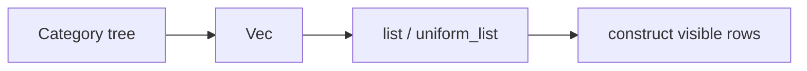

`list`/`uniform_list` có cùng mục tiêu sử dụng với web virtualizer như TanStack Virtual, nhưng không phải API hoặc implementation tương đương 1:1.

**Anti-pattern:**

```rust
// Sai: vẫn scan toàn bộ 100k items trước khi virtualizer render viewport.
let visible_candidates = all_items
    .iter()
    .filter(|item| expensive_filter(item))
    .collect::<Vec<_>>();
```

Filter/sort lớn phải chuyển sang store update, background task hoặc incremental index.

### 12.3 Animation

Ưu tiên animation không làm thay đổi layout geometry:

- opacity;
- transform/translation/scale/rotation ở paint/composite-friendly path;
- bounded visual state.

Tránh animate liên tục:

- width/height của ancestor lớn;
- padding/margin làm relayout subtree lớn;
- list row height không ổn định khi scroll;
- text metrics trên nhiều rows.

Không được khẳng định mọi transform luôn “zero layout cost”; cần profile implementation thực tế.

### 12.4 Cached elements

Cached elements có thể giảm repeated work khi identity/input ổn định. Không nên mô tả `.cached()` là guarantee tuyệt đối rằng toàn bộ layout và paint luôn bị skip.

Cache key phải bao gồm mọi input ảnh hưởng output. Cache phải có:

- capacity bound;
- eviction policy;
- invalidation strategy;
- resource release;
- metrics hit/miss khi cần debug.

---

# PHẦN VI — Web optimization techniques và mapping sang GPUI

> Section này bổ sung các browser scheduling/rendering techniques có thể học để áp dụng về mặt tư duy. Mapping sang GPUI là **conceptual**, không phải API equivalence.

## 13. Chọn scheduler theo loại work

| Work | Web API phù hợp | Ghi chú |
|---|---|---|
| Visual update của frame kế tiếp | `requestAnimationFrame` | dùng cho DOM/canvas visual work |
| Non-critical background work | `requestIdleCallback` | limited availability; required work cần `timeout` và fallback |
| Task có priority | `scheduler.postTask` | `user-blocking`, `user-visible`, `background`; cần feature detection |
| Split long task | `scheduler.yield()` | yield về main thread rồi tiếp tục với prioritized continuation |
| CPU-heavy computation | Web Worker | tránh block main thread |
| Load/render khi gần viewport | `IntersectionObserver` | async visibility observation |
| Skip offscreen rendering | `content-visibility: auto` | kết hợp `contain-intrinsic-size` để giảm layout shift |
| Pause khi tab hidden | Page Visibility API | giảm timer/polling/background animation |

### 13.1 `requestIdleCallback`

Dùng cho work không critical:

- warm cache;
- precompute suggestion;
- low-priority analytics preparation;
- cleanup nhỏ;
- preload data không ảnh hưởng current interaction.

Không dùng cho:

- input response;
- required state update;
- animation;
- task có deadline cứng mà không có timeout;
- CPU loop dài chạy một lần đến hết.

```ts
export function scheduleIdleWork(
  work: () => void,
  timeout = 1_500,
): () => void {
  if ("requestIdleCallback" in window) {
    const id = window.requestIdleCallback(
      (deadline) => {
        if (deadline.timeRemaining() > 0 || deadline.didTimeout) {
          work();
        }
      },
      { timeout },
    );

    return () => window.cancelIdleCallback(id);
  }

  // Fallback này chỉ defer sang task khác; không guarantee browser đang idle.
  const id = window.setTimeout(work, 0);
  return () => window.clearTimeout(id);
}
```

Với queue lớn, process theo budget:

```ts
function drainQueue(deadline: IdleDeadline): void {
  while (
    queue.length > 0 &&
    (deadline.timeRemaining() > 2 || deadline.didTimeout)
  ) {
    processOne(queue.shift()!);
  }

  if (queue.length > 0) {
    requestIdleCallback(drainQueue, { timeout: 1_000 });
  }
}
```

> `requestIdleCallback` không phải Web Worker. Callback vẫn chạy trên main thread.

### 13.2 `scheduler.postTask`

Dùng khi cần task priority rõ hơn:

```ts
type TaskPriority = "user-blocking" | "user-visible" | "background";

export async function postPrioritizedTask<T>(
  callback: () => T | Promise<T>,
  priority: TaskPriority,
): Promise<T> {
  if ("scheduler" in globalThis && "postTask" in globalThis.scheduler) {
    return globalThis.scheduler.postTask(callback, { priority });
  }

  return new Promise<T>((resolve, reject) => {
    setTimeout(() => {
      Promise.resolve(callback()).then(resolve, reject);
    }, 0);
  });
}
```

Priority example:

- `user-blocking`: state update trực tiếp từ click/keyboard;
- `user-visible`: render data user sắp nhìn thấy;
- `background`: cache warm-up, non-critical indexing.

### 13.3 Split long tasks bằng `scheduler.yield()`

```ts
async function yieldToMain(): Promise<void> {
  if ("scheduler" in globalThis && "yield" in globalThis.scheduler) {
    await globalThis.scheduler.yield();
    return;
  }

  await new Promise<void>((resolve) => setTimeout(resolve, 0));
}

async function processItems(items: Item[]): Promise<Result[]> {
  const results: Result[] = [];

  for (let index = 0; index < items.length; index += 1) {
    results.push(expensiveTransform(items[index]));

    if (index % 100 === 0) {
      await yieldToMain();
    }
  }

  return results;
}
```

`queueMicrotask()` hoặc `Promise.resolve().then(...)` **không phải cách yield để browser render**. Một chain microtask dài vẫn có thể delay input và rendering.

### 13.4 `requestAnimationFrame`

Visual DOM write nên được coalesce vào frame:

```ts
let framePending = false;
let pendingX = 0;

function scheduleTranslate(x: number): void {
  pendingX = x;

  if (framePending) return;
  framePending = true;

  requestAnimationFrame(() => {
    framePending = false;
    element.style.transform = `translateX(${pendingX}px)`;
  });
}
```

Khi cần geometry:

1. batch tất cả layout reads;
2. sau đó batch style writes;
3. không xen kẽ read/write trong loop.

```ts
requestAnimationFrame(() => {
  const heights = rows.map((row) => row.getBoundingClientRect().height);

  rows.forEach((row, index) => {
    row.style.setProperty("--measured-height", `${heights[index]}px`);
  });
});
```

### 13.5 Web Workers

Move CPU-heavy work khỏi main thread:

- image processing;
- search indexing;
- large JSON transform;
- encryption/compression;
- syntax/Markdown processing khi architecture cho phép.

Không move DOM access vào Worker vì Worker không truy cập DOM trực tiếp.

### 13.6 `IntersectionObserver`

Dùng thay vì tự đọc `getBoundingClientRect()` trên mỗi scroll event cho:

- image lazy load;
- prefetch khi item gần viewport;
- activate/deactivate media;
- viewability tracking;
- incremental hydration/render.

```ts
const observer = new IntersectionObserver(
  (entries) => {
    for (const entry of entries) {
      if (!entry.isIntersecting) continue;
      loadPreview(entry.target as HTMLElement);
      observer.unobserve(entry.target);
    }
  },
  { rootMargin: "300px" },
);
```

### 13.7 `content-visibility`

Cho long document/feeds mà content vẫn nằm trong DOM:

```css
.feed-section {
  content-visibility: auto;
  contain-intrinsic-size: auto 320px;
}
```

Browser có thể skip layout/paint cho offscreen content cho đến khi cần. `contain-intrinsic-size` cung cấp estimated size để giảm layout shift.

`content-visibility` không thay thế hoàn toàn virtualized list:

- DOM nodes vẫn tồn tại;
- memory cost vẫn có thể lớn;
- virtualized list vẫn phù hợp hơn với hàng chục nghìn rows interactive.

### 13.8 Page Visibility API

```ts
document.addEventListener("visibilitychange", () => {
  if (document.hidden) {
    pausePresencePolling();
    pauseNonCriticalAnimation();
  } else {
    resumePresencePolling();
    refreshStaleData();
  }
});
```

Áp dụng cho:

- polling;
- animation;
- telemetry batching;
- media;
- stale data refresh khi tab quay lại.

### 13.9 Các technique khác nên dùng trên Web

- `passive: true` cho `touchstart`/`wheel` listener không gọi `preventDefault()`;
- dynamic `import()` và route-level code splitting;
- lazy image với `loading="lazy"` khi phù hợp;
- `AbortController` cancel fetch cũ;
- debounce search, throttle telemetry, coalesce scroll updates;
- immutable/no-op guards để tránh unnecessary React re-render;
- Web Performance API, Long Tasks/Long Animation Frames và React Profiler để đo trước khi optimize;
- tránh oversized global state subscription;
- preload chỉ critical resources, không preload mọi thứ.

---

## 14. Mapping Web optimization sang GPUI

| Web technique | GPUI/Mezon equivalent về tư duy |
|---|---|
| `requestAnimationFrame` | `cx.on_next_frame`, frame-coalesced visual updates |
| `requestIdleCallback` | low-priority/background work; GPUI không có direct 1:1 guarantee |
| `scheduler.postTask` | phân loại foreground/background priority trong app scheduler design |
| `scheduler.yield()` | chunk CPU work hoặc chuyển sang background executor |
| Web Worker | `background_spawn` / background executor |
| `IntersectionObserver` | visible-range state, virtualized list, prefetch near viewport |
| `content-visibility` | virtualized list, split view entities, avoid notify hidden views, cached subtree |
| `AbortController` | cancellable `Task`, abort handle, generation guard |
| React memoization | stable view-model, no-op guard, cached elements |
| Page Visibility API | window activation/visibility lifecycle; pause non-critical work |

### 14.1 GPUI example: background CPU work

```rust
pub fn rebuild_search_index(&mut self, cx: &mut Context<Self>) {
    let snapshot = Arc::clone(&self.search_source);

    let task = cx.background_spawn(async move {
        build_index(snapshot)
    });

    self.index_task = Some(cx.spawn(async move |this, cx| {
        let index = task.await;

        let _ = this.update(cx, |this, cx| {
            this.search_index = Some(index);
            cx.notify();
        });
    }));
}
```

Không giữ lock qua `.await`. Snapshot đầu vào phải bounded hoặc shared bằng `Arc` thay vì clone collection lớn.

### 14.2 GPUI example: coalesce high-frequency event

Presence/typing event không nên notify mỗi packet:

```rust
fn queue_presence_update(&mut self, update: PresenceUpdate, cx: &mut Context<Self>) {
    self.pending_presence.insert(update.user_id, update);

    if self.presence_flush_task.is_some() {
        return;
    }

    self.presence_flush_task = Some(cx.spawn(async move |this, cx| {
        cx.background_executor()
            .timer(std::time::Duration::from_millis(32))
            .await;

        this.update(cx, |this, cx| {
            apply_presence_batch(
                &mut this.presence,
                std::mem::take(&mut this.pending_presence),
            );
            this.presence_flush_task = None;
            cx.notify();
        })
    }));
}
```

Exact timer/executor API cần match current vendor API, nhưng pattern là:

- accumulate;
- schedule một flush;
- apply batch;
- notify một lần.

---

# PHẦN VII — Performance, memory và correctness rules

## 15. Performance rules

### 15.1 Foreground thread

- không block;
- không disk/network I/O;
- không decode/parse lớn;
- không giữ mutex qua `.await`;
- không scan toàn history trong render/input handler;
- move CPU-heavy work sang background executor;
- chunk work nếu vẫn phải chạy trên foreground.

### 15.2 Invalidation

- notify chỉ khi state thật sự đổi;
- scope notification ở entity nhỏ nhất hợp lý;
- không dùng `refresh_windows()` cho local update;
- coalesce burst events;
- tránh update root-level size/style cho row-level change;
- hidden/inactive views không cần sync mọi high-frequency update nếu không cần.

### 15.3 Clone cost

Cheap thường là:

- `Entity<T>`;
- `WeakEntity<T>`;
- `Arc<T>`;
- `SharedString` tùy representation;
- small Copy IDs.

Cần review kỹ:

- `Vec<Message>::clone()`;
- `HashMap::clone()`;
- `read_with(|state| state.clone())` trên store lớn;
- `format!` cho mọi visible row mỗi frame;
- clone image bytes hoặc decoded pixels.

### 15.4 Memory

- normalize entity data: `HashMap<Id, T>` + ordered `Vec<Id>` khi phù hợp;
- selection giữ ID, không giữ duplicate object;
- message history pagination;
- bounded LRU cho image/avatar/text layout;
- release GPU image khi evict;
- bounded logs/event buffers;
- clear screen-local state khi route/window close;
- tránh giữ `Entity` strong handle trong long-lived callback khi chỉ cần `WeakEntity`.

### 15.5 Task rules

Mỗi task phải thuộc một trong ba nhóm:

1. awaited;
2. stored trong field;
3. detached có comment/reason và error handling.

Không được:

- drop task ngay sau `spawn()` ngoài ý muốn;
- spawn duplicate task mỗi keystroke;
- detach unbounded loop không có shutdown path;
- ignore error từ fire-and-forget mutation;
- giữ strong owner cycle.

---

## 16. Robustness và security conventions

### Robustness

- không `unwrap()`/`expect()` với server bytes/data;
- typed error thay vì magic string;
- không fallback invalid ID về `0`;
- timeout cho network operation;
- retry phải bounded và có backoff/jitter;
- stale response guard;
- reconnect handlers không register duplicate subscription;
- protobuf/JSON input phải có size limits khi có thể.

### Layering

- DTO không đi vào UI;
- UI không depend `mezon-client`;
- một Router shared theo intended scope;
- store tự xử lý realtime domain event;
- `vendor/**` chỉ update theo controlled upstream sync.

### Security

- không disable TLS/certificate verification trong production;
- không log token, credential, session payload;
- strip query/fragment khi URL có thể chứa secret;
- validate file extension, MIME type và size;
- không render raw backend/debug object vào UI;
- sanitize/escape untrusted rich content theo renderer behavior.


### 16.4 UI parity và i18n

- React/Web parity là visual contract, không phải yêu cầu copy component architecture 1:1;
- map spacing/size tokens rõ ràng, ví dụ `h-[34px]` → `h(px(34.))`;
- dùng đúng icon asset và interaction state của reference UI;
- user-visible text đi qua `mezon_i18n::t`;
- backend/debug payload không được render trực tiếp thành message content;
- loading/skeleton behavior phải được mô tả bằng state machine thay vì scattered booleans.

---

## 17. Review checklist trước PR

### Architecture

- [ ] Dependency direction đúng layer.
- [ ] UI không giữ API DTO.
- [ ] State có một owner rõ ràng.
- [ ] Global chỉ dùng cho app-wide scope.

### Render

- [ ] Không I/O/parse/decode/sort lớn trong `render()`.
- [ ] Large list dùng virtualization.
- [ ] Không clone collection lớn trong render path.
- [ ] Observer có no-op/equality guard.

### Async

- [ ] Task được await/store/detach có chủ đích.
- [ ] Có cancellation hoặc generation guard.
- [ ] Loading/error được reset trên mọi path.
- [ ] Không giữ lock qua `.await`.
- [ ] Reconnect không tạo duplicate listener/task.

### Memory

- [ ] Cache bounded và có eviction.
- [ ] GPU/image resource được release.
- [ ] History/log/buffer bounded.
- [ ] Back-reference dùng `WeakEntity` khi phù hợp.

### Security

- [ ] Không log secret.
- [ ] Không disable certificate verification.
- [ ] File/server input được validate.

### Commands

```bash
just check
just lint
just test
```

---

# References

- GPUI README — hybrid immediate/retained mode: <https://github.com/zed-industries/zed/blob/main/crates/gpui/README.md>
- GPUI `Context` 0.2.2: <https://docs.rs/gpui/0.2.2/gpui/struct.Context.html>
- GPUI `Task` 0.2.2: <https://docs.rs/gpui/0.2.2/gpui/struct.Task.html>
- GPUI `Subscription` 0.2.2: <https://docs.rs/gpui/0.2.2/gpui/struct.Subscription.html>
- MDN `requestIdleCallback`: <https://developer.mozilla.org/en-US/docs/Web/API/Window/requestIdleCallback>
- MDN `requestAnimationFrame`: <https://developer.mozilla.org/en-US/docs/Web/API/Window/requestAnimationFrame>
- MDN `scheduler.postTask`: <https://developer.mozilla.org/en-US/docs/Web/API/Scheduler/postTask>
- MDN `scheduler.yield`: <https://developer.mozilla.org/en-US/docs/Web/API/Scheduler/yield>
- MDN Web Workers: <https://developer.mozilla.org/en-US/docs/Web/API/Web_Workers_API/Using_web_workers>
- MDN Intersection Observer: <https://developer.mozilla.org/en-US/docs/Web/API/Intersection_Observer_API>
- MDN `content-visibility`: <https://developer.mozilla.org/en-US/docs/Web/CSS/content-visibility>
- web.dev long tasks: <https://web.dev/articles/optimize-long-tasks>

---

**🦀**
